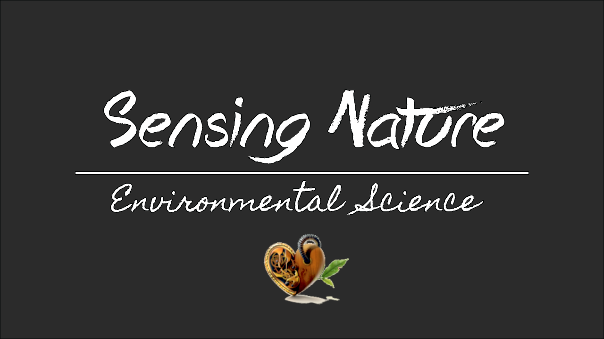

# Sensing Nature
I consider myself a creative person, a wild adventurer and a cultural traveler. I really enjoy creating outdoor social media content to promote environmental awareness. I also have a background in electronics and programming, so I often build inexpensive technological devices with microcomputers to extract useful and valuable environmental information.

#### You can checkout my web [**Here**](https://sensing-nature.github.io) :flower:

# What it's all about:
* Environmental Science
* Audiovisuals
* Electronics
* Nature
* Environmental Education
* Environmental Management
